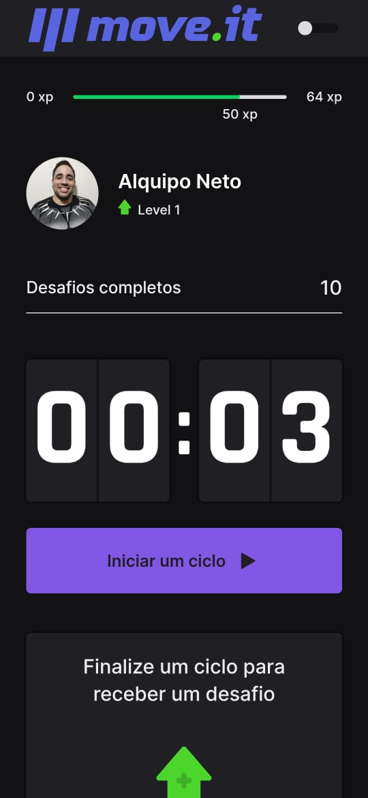
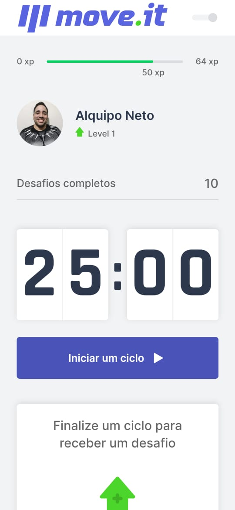
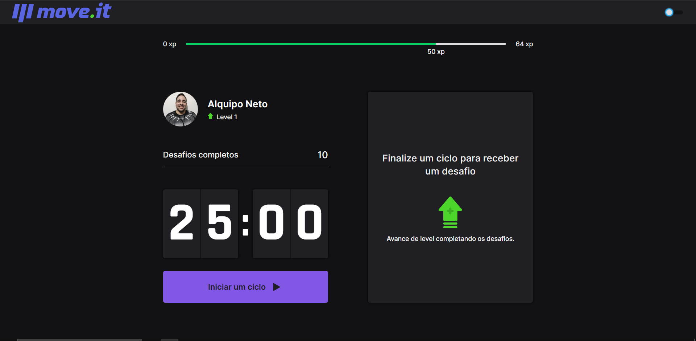
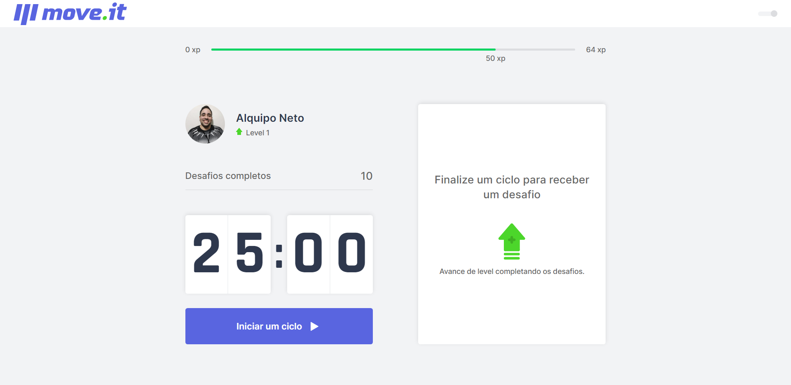

<p align="center">
  
</p>

<h1 align="center">
🚧 MoveIt | Em Construção 🚧
</h1>

<p align="center">

  

  

  <a href="https://www.linkedin.com/in/alquiponeto/">
      
  </a>

  <a href="https://github.com/Alquipo/moveit/commits/master">
      
  </a>

  


</p>

<p align="center">

  <a target="_blank" href="https://reactjs.org/">
    
  </a>

  <a target="_blank" href="https://nextjs.org/">
      
  </a>
</p>

<h2 align="center">
  Bem Vindo ao App MoveIt
</h2>

## :information_source: O que é Next Level Week?

O [NLW](https://nextlevelweek.com/inscricao/1) é uma semana prática com muito código, desafios, network e com um único objetivo: levá-lo ao próximo nível.
Através do método da [Rocketseat][rs], você aprenderá novas ferramentas, tecnologias e descobrirá hacks que irão impulsionar sua carreira.
Um evento online e totalmente gratuito que o ajudará a dar o próximo passo na sua evolução como desenvolvedor.

## 🚀 Sobre o Projeto

MoveIt e uma aplicação para incentivar que fica horas no computador para se exercitar, usando o método pomodoro, a cada 25 minutos concentrado no trabalho ele terá uma pausa para efetuar um pequeno exercício e com adição da gamificação na aplicação tudo fica mais divertido.

## 🎨 Layout

Design feito por [Tiago Luchtenberg](https://www.instagram.com/tiagoluchtenberg/)

### Mobile

<h4 align="center">
  
  
  
  <!--  -->
</h4>

### Web

<!-- <h4 align="center">
  
</h4> -->
<h4 align="center">
  

  
</h4>

## :tada: Melhorias

Com aprendizado da **NLW** acabei realizando melhorias no projeto

##### - Melhorias na Aplicação: :medal_sports:

    -Adicionado theme dark na aplicação;
    -Adicionado opção de PWA na aplicação;
    -Adicionado Switch para alterar os themes;
    -Adicionado Ícones para representar os botões;
    -Efetuado diversos ajustes no designer da aplicação;
    -Efetuado ajustes para o mobile e PWA;

## 🔨 Tecnologias:

- **[TypeScript](https://www.typescriptlang.org/)**
- **[NextJS](https://nextjs.org/)**
- **[Styled Components](https://styled-components.com/)**
- **[Jest](https://jestjs.io/)**
- **[React Testing Library](https://testing-library.com/docs/react-testing-library/intro)**
- **[Storybook](https://storybook.js.org/)**
- **[Eslint](https://eslint.org/)**
- **[Prettier](https://prettier.io/)**
- **[Husky](https://github.com/typicode/husky)**
- **[PlopJS](https://plopjs.com/)**
- **[Polished](https://polished.js.org/)**
- **[Styled-Icons](https://styled-icons.js.org/)**

## 🔎 Comandos

- `dev`: Executa a aplicação em `localhost:3000`
- `build`: Cria a Build do projeto
- `start`: Inicia um servidor simples com o código de produção
- `lint`: Executa o **Linter** em todos os componentes e páginas
- `test`: Executa **Jest** para testar todos os componentes e páginas
- `test:watch`: Executa **Jest** em watch mode
- `storybook`: Executa **Storybook** em `localhost:6006`
- `build-storybook`: Cria uma build do storybook
- `generate`: Cria automaticamente um componente

## 🚀 Como rodar este projeto

Para clonar e executar este aplicativo, você precisará de [Git](https://git-scm.com) e [NodeJs](https://nodejs.org/en/) Instalado em seu computador.

### 🌀 Clonando o repositório

```bash
# Clone este repositório
$ git clone https://github.com/Alquipo/moveit

# Acesse a pasta do projeto no terminal/cmd
$ cd moveit
```

### 🎲 Rodando a Aplicação

```bash
# Instale as dependências
$ yarn install

# Execute a Aplicação em Desenvolvimento
$ yarn dev

# O servidor inciará na porta:3000 - acesse http://localhost:3000

```

### 💾 Comandos Úteis

```bash
#Criação de um componente completo com (index.tsx / stories.tsx / styles.ts / test.tsx)
$ yarn generate ComponentName

#Rodar o Storybook
$ yarn storybook

#Rodar os testes
$ yarn test

```

## 🤔 Como contribuir para o projeto

- Faça um **fork** do projeto;
- Crie uma nova branch com as suas alterações: `git checkout -b my-feature`
- Salve as alterações e crie uma mensagem de commit contando o que você fez:`git commit -m "feature: My new feature"`
- Envie as suas alterações: `git push origin my-feature`

> Caso tenha alguma dúvida confira este [guia de como contribuir no GitHub](https://github.com/firstcontributions/first-contributions)

## 📝 Licença

Este projeto esta sobe a licença MIT. Veja a [LICENÇA](https://opensource.org/licenses/MIT) para saber mais.

Feito com ❤️ por Alquipo Neto 👋🏽 [Entre em contato!](https://www.linkedin.com/in/alquiponeto/)
